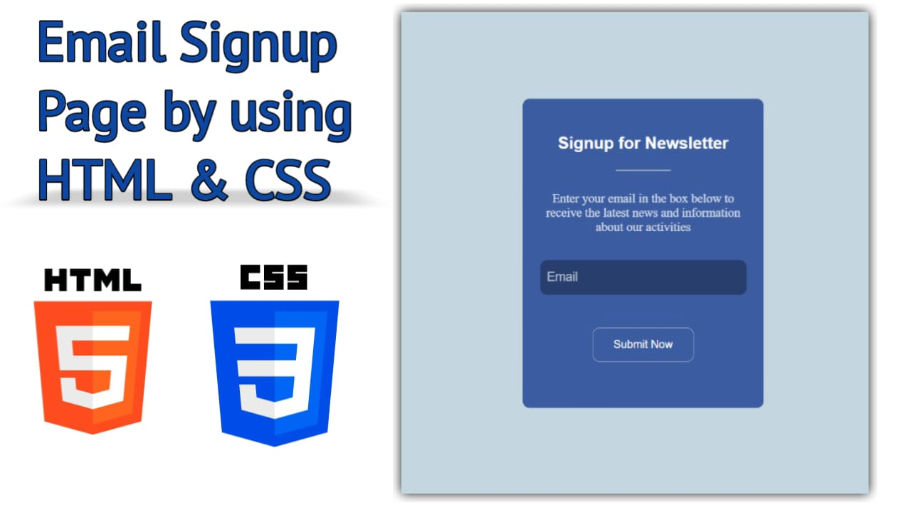

# Email Signup Form

This is a responsive email signup form built with HTML and CSS. The form allows users to sign up for a newsletter by entering their email address. The design is simple yet modern, featuring smooth hover effects and a mobile-friendly layout.

## Demo Screenshot

## Live Demo

* You can check out the live demo of the project [here]().

## Table of Contents
1. [Features](#features)
2. [Project Structure](#project-structure)
3. [Code Explanation](#code-explanation)
4. [Contributing](#contributing)
5. [Contact](#contact)

## Features

- **Responsive design**: The form is fully responsive, adapting to different screen sizes with the use of media queries.
- **CSS hover effects**: Interactive effects like button shadowing and form transformations on hover.
- **Simple and clean UI**: The form is designed to be minimalistic, focusing on ease of use and readability.
- **Newsletter sign-up**: The form collects email addresses to sign users up for newsletters.

## Project Structure

The project consists of a single HTML file with embedded CSS. All the necessary styles are written directly within the HTML document for simplicity.

## Code Explanation

### 1. HTML Structure

The form consists of a `container` element that includes the heading, description, and the form itself.

- The form uses the `POST` method to submit the data to a mock endpoint (`https://httpbin.org/post`).
- An email input field is included with `placeholder` text, and a submit button allows users to send their email address.

### 2. CSS Styling

- **Body**: The body has a `flexbox` layout to center the form both vertically and horizontally, with a light blue background color.
- **Container**: The form container has a dark blue background, rounded corners, and a box-shadow effect on hover.
- **Form Inputs**: The input field for email is styled to have a clean look, and the button has interactive effects when hovered over.
- **Responsive Design**: Media queries ensure the form is adaptable to smaller screens:
  - For screen widths below `400px`, the form resizes, and input fields become narrower.
  - For screen widths below `275px`, further adjustments are made to the heading, input size, and button size.

## Contributing

- If you have suggestions for improvements or bug fixes, feel free to create a pull request or open an issue.

## Contact

For any questions or comments, please reach out to:
- **Email**: [premkumar224487@gmail.com](mailto:premkumar224487@gmail.com)
- **GitHub**: [premkrrajbhar](https://github.com/premkrrajbhar)
